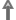
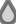

pro.pavpen.openscad Libraries
=============================

A collection of re-usable OpenSCAD code.

# Contents

## Parametric Symbols

See `pro.pavpen/symbols` for more details.  The symbols include:

* 3D Printer Nozzle: 
* Arrow: 
* Liquid (e.g. Water) Drop: 
* Machine Oil Dispenser: 
* Machine Oiling: 


## Basic List Functions

* Sum all elements.
* Drop the last `n` elements.


## Basic 2D and 3D Linear Transformation Matrices

Transforms include:

* Rotation
* Translation
* Scaling


## 2D Polygonal Objects

2D objects composed of polygon unions and differences.

The polygons are represented as lists so that they can be combined,
transformed and used in other libraries, e.g., for skinning and lofting
between polygons.

The can be rendered as OpenSCAD polygons and linearly extruded.


# Installation

Clone this repository under your OpenSCAD installation's libraries directory.

E.g., on Ubuntu:

```bash
sudo su
cd /usr/share/openscad/libraries
git clone https://github.com/pavpen/pro.pavpen.openscad.git
```


# License

You can use this code either under GPL v.3, or Creative Commons 
Attribution-ShareAlike 4.0 International at your option.

If you need to use it under another license, open an issue.
